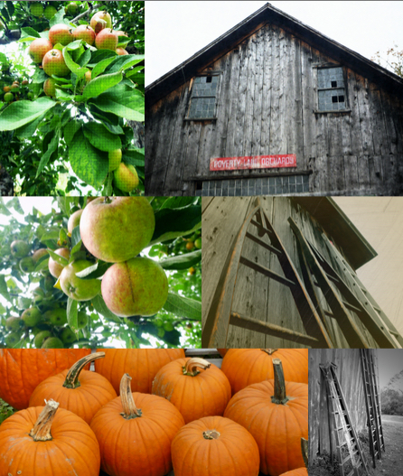

# Ashlar

Ashlar is a dynamic layout engine suitable for arranging images into a
rectangular space of a specified width while maintaining the original aspect
ratios and crops.  Other similar layout engines generally resort to cropping
or allowing uneven bottom edges.  Ashlar uses scaling of images only and the
resultant layout will always have aligned edges.

Optionally, the layout may be chunked such that the final result is a series
of vertically stacked layouts with a specified maximum number of images in
each.

# Dependencies

Ashlar relies on [Sylvester](http://sylvester.jcoglan.com/) for the matrix
math required to solve the layout while maintaining aspect ratios.

# API

Use the init() function to layout a container with images specified in HTML:

    

        

        

        

        

        

        

    

    

Or, for maximum flexibility, use the layout() function directly to get raw
layout data given the aspect ratios and priorities of the content to arrange
at a given width and with the given number of tiles per chunk.

    var photos = [{aspect: 0.75, priority: 1},
                  {aspect: 1.33, priority: 1},
                  {aspect: 0.5, priority: 1},
                  {aspect: 1.33, priority: 1},
                  {aspect: 0.75, priority: 1},
                  {aspect: 0.5, priority: 1},
                  {aspect: 1.33, priority: 1}];

    // Tiles are defined by javascript objects with the properties
    // x, y, width, height and can be used to position the
    // corresponding images as desired.
    var tiles = ashlar.layout(photos, 1024, 5);

# License

See [LICENSE](LICENSE) file.
